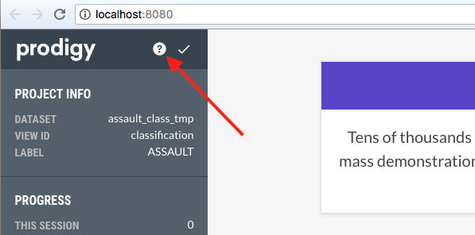

# Minimal working example (basic text annotation)

## Preparing data

Prodigy prefers data to come in as newline-delimited JSON (JSONL).

`text_to_jsonl.py` will convert a plaintext file with one example per line to
JSONL so Prodigy can easily read it in.

Example using sentences from the CAMEO codebook:

```
python text_to_jsonl.py -i assault_not_assault.txt -o assault_not_assault.jsonl
```

## Running Prodigy

A simple binary classification annotation task without a model in the loop can
be started with Prodigy's "mark" interface like this:

```
prodigy mark assault_class assault_not_assault.jsonl --label ASSAULT --exclude assault_class --view-id classification
```

The first two arguments to `mark` are positional, and indicate the dataset to
store the results in (`assault_class`) and the source of annotations to display
(`assault_not_assault.jsonl`). If the dataset does not already exist in
Prodigy's database, it will create it automatically. 

`--label ASSAULT` indicates the class that annotators should accept or reject
for each example. 

`--exclude assault_class`: this ensures that if Prodigy is stopped and
restarted, any examples that are already in the dataset called `assault_class`
will be excluded from the stream, i.e. they will not be presented again for
re-annotation, saving time, frustration, and confusion.

`--view-id classification` means that Prodigy should display the tasks in its
classification format, asking for binary decisions on a provided label, rather
than a different interface such as manual highlighting, multiple choice, image
selection, etc.

## Instructions

Prodigy includes the ability to add instructions to annotators. The
instructions can be given either as plain text or HTML. The `prodigy.json`
config file can be modified to include `"instructions": "/path/instructions"`,
and the interface will then include an info icon that can pull them up. E.g.:


