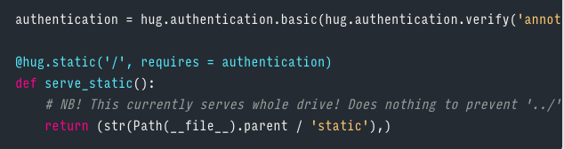

# Running Prodigy on a Remote Server

Running Prodigy on a remote server is similar to running it locally. The main
differences consist of having Prodigy listen for requests coming from outside
the server, opening the needed ports on the server, and configuring basic
authentication to discourage unauthorized access.

### Changing network binding

Prodigy's configuration is set by a `.prodigy.json` file, either in Prodigy's
home directory (`~/.prodigy/`) or on a per-project basis in the directory where
Prodigy is started (the leading `.` is optional). By default, Prodigy only accepts requests coming from
`localhost` to prevent outside access. To have Prodigy accept requests from
outside, the Prodigy config needs to have `"host": "localhost"` changed to
`"host": 0.0.0.0"` (see included `.prodigy.json`).

### Opening ports on EC2

When creating an EC2 instance, you'll need configure its security group to
allow traffic to the port that Prodigy is running on (by default, this is 8080):

### Basic authentication

Opening the port opens it to all the world. To prevent anyone from accessing
Prodigy, you need configure some form of authentication. Simple HTTP
authentication requires a password to access a page, but importantly, it does
not encrypt your traffic end-to-end, so beware of having your credientials
sniffed.

To enable basic HTTP authentication, you need to change a line in the Prodigy
source code.

1. Figure out where Prodigy is installed by running the following in the
   terminal: `python -c 'import prodigy; print(prodigy.__file__)`. This should
   look something like `/Users/ahalterman/anaconda3/lib/python3.6/site-packages/prodigy/__init__.py`.
2. Open the `app.py` file that's in the `prodigy/` directory you just located.
3. Add the following line anywhere in the file to set the username and password
   (changing them to be the ones you want to use):
    `authentication = hug.authentication.basic(hug.authentication.verify('annotator1', 'mypassword'))`
4. Above the `serve_static()` function, change `@hug.static('/')` to `@hug.static('/', requires = authentication)`
   to enable authentication (see screenshot).

### Other EC2 setup

The standard steps for setting up EC2 also need to be followed. Specifically, a
new SSH key needs to be created unless there's an existing EC2 key. (See
screenshot). After downloading the `.pem` key, the permissions need to be
changed: `chmod 400 my_ec2_key.pem`. Then make sure you include the key when
sshing in: `ssh -i /path/to/my_ec2_key.pem ubuntu@31.411....`.

You may also wish to ensure that Anaconda is installed on the remote server.

### Prodigy on a remote server

Installing Prodigy on server is almost identical to installing on a laptop. The
main difference is that you won't be downloading it directly to the server, but
instead downloading to your laptop and then uploading to the server.

1. Download Prodigy onto your laptop using the company link. Make sure you
   download the Linux version.
2. `cd` into your Downloads directory or the location where you downloaded
   Prodigy.
3. Copy the Prodigy `.whl` to the server by running the following command, with
   the appropriate username and paths replaced:
   `scp -i /path/to/key.pem prodigy-1.5.1-cp35.cp36-cp35m.cp36m-linux_10_13_x86_64.whl
   user@131.??.???.???:/home/user`
4. Log into the remote server as above.
5. `cd` into the home directory (or other location where you copied the wheel
   file) and run `pip install prodigy-1.*.whl` to install.
